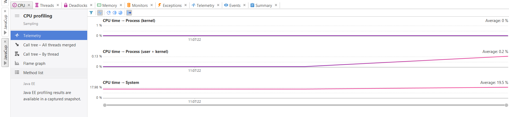

# SELabEXP4
| نام          | شماره دانشجویی|
| ------------- | ------------- |
| علیرضا عالیپناه                  | 99106396      |
| سیدمحمدیوسف نجفی      | 99102361      |
| علی نظری                        | 99102401      |

در گام اول بخش 
profiling
نیاز بود تا 
YourKit
را نصب کنیم که همین کار را هم انجام دادیم:

  

و سپس مرحله‌های فعال‌سازی را جلو می‌بریم:

  

  

  

سپس به این مرحله می‌رسیم که این ابزار را با 
Intellij
همراه کنیم که در عکس‌های زیر، سلسله مراتب انجام آن را قرار دادیم:

  

  

  

حال به مرحله 
profile 
کردن برنامه می‌رسیم که به شکل زیر آغاز می‌شود:

  

ولی این برنامه انقدر رم مصرف می‌کند که ارور
out of memory
را دریافت می‌کنیم:

  

مصرف منابع هم به شکل زیر بوده است:

  

  

حال باید ببینیم کدام متد بوده که مصرف بیش از اندازه داشته است که با بررسی‌های انجام شده و عکس‌های زیر متوجه می‌شویم که متد 
temp
بوده است:

  

  

دلیل این مصرف بیش از اندازه هم حلقه تو در تو به تعداد زیاد و اضافه کردن تعداد زیادی عدد به یک آرایه است که باعث شده هم مصرف 
cpu
یک پیک بزند و هم مصرف مموری.

روی نقطه پیک هم که کلیک کنیم، می‌بینیم که همان تابع 
temp
است که دارد اجرا می‌شود و باعث این پیک شده است:

  

حال به مرحله‌ای می‌رسیم که کد موجود را بهبود بدهیم. برای اینکار همانطور که می‌دانیم، 
ArrayList
چون حالت داینامیک دارد هم رم بسیار زیادی مصرف می‌کند و هم اضافه و کم کردن عضو به آن کندتر است و در این سناریو که ما می‌دانیم چه تعداد داده قرار است به آرایه اضافه شود، می‌توانیم از آرایه معمولی استفاده کنیم:

  

حال مجدد برنامه را 
profile
می‌کنیم و همانطور که دیده می‌شود دیگر ارور
out of memory 
را دریافت نمی‌کنیم و برنامه به درستی ران می‌شود:

  

حال نتایح پروفایل برنامه هم به شکل زیر است:

  

  

زمان اجرا 
temp
با اینکه باز بیشتری مقدار بین بقیه است ولی نسبت به قبلی به میزان خیلی زیادی کمتر شده است:

  

در نهایت روی پیک هم که کلیک کنیم، دیگر روی 
temp
گیر نکرده است و همه مراحل جلو رفته است و خود پیک هم بسیار کوچک‌تر شده است:

  

برای بخش دوم که یک الگوریتم خودمان باید بگذاریم که اول خوب نباشد ولی بعدش خوب بشود، تصمیم گرفتیم که ضرب ماتریسی را انتخاب کنیم. در روش غیر افیشنت، کل ماتریس را دانه دانه ضرب می‌کنیم و جلو می‌رویم که عکس کد آن به این شکل است:

  

این کد در فایل
OurOwnAlgorithmBad.java
قرار دارد و آن را پروفایل می‌کنیم:

  

همانطور که دیده می‌شود این برنامه در کل مصرف 
cpu
بالایی دارد و هراز گاهی هم پیک می‌زند که روی یکی از پیک‌ها کلیک کنیم به شکل زیر است:

  

که مشخص است از همان متد ضرب ماتریس است. حال زمان اجرای این برنامه هم بسیار بد است:

  

حال برنامه را با روش 
tile
کردن بهبود می‌دهیم به این شکل که ماتریس را به تعدادی 
tile
تقسیم‌بندی می‌کنیم و اول این 
tile
ها را ضرب می‌کنیم و به شکل پله‌ای جلو می‌رویم:

  

حال این برنامه را 
profile
می‌کنیم:

  

که مشخص است دیگر پیکی نداریم و زمان اجرا هم به شکل قابل توجهی کاهش پیدا کرده است:

  

این برنامه چون برای هر دو دو ماتریس با اندازه یکسان می‌سازد و نتیجه هم در ماتریس جدیدی می‌گذارد، مصرف رم و مموری هر دو دقیقا یکسان است و برای همین به آن در گزارش اشاره‌ای نشده است.
